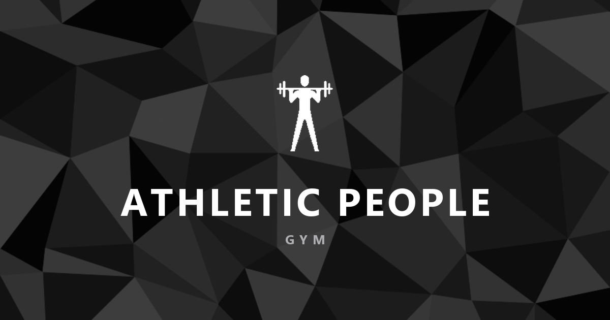

# Athletic People Gym

Sign-in screen for a gym, built as a static site with no dependencies and no build step.

[](https://athleticpeoplegym.wib.digital)
[](https://www.fiverr.com/pablonietop)




## Description

A login card centred over a low-poly background that drifts slowly behind it. The background is a single SVG scaled to cover the viewport; the drift is a ten-second alternating CSS animation driven by `transform` on a fixed pseudo-element, so it composites on the GPU instead of repainting the viewport on every frame.

The form validates on the client — email format, required fields, minimum password length — and reports errors inline, wired to the inputs with `aria-describedby` and `aria-invalid`. There is no authentication backend. Rather than fake a successful sign-in, the form says so explicitly: input is validated in the browser and never sent anywhere. The card states this before you type, and again in the result message.

Everything is served from the repository as-is. No package manager, no bundler, no external requests — no CDN, no web fonts, no analytics. The type is the system UI stack.

## Features

- Client-side form validation with inline, field-level error messages.
- Accessible form semantics: real `<label>` elements, `aria-describedby`, `aria-invalid`, and live regions for errors and status.
- Full keyboard operation with a visible focus ring on every interactive element.
- Mobile-first responsive layout, verified at 360, 768, 1024 and 1440 px with no horizontal scroll.
- GPU-composited background animation, disabled under `prefers-reduced-motion`.
- Design tokens in `:root` — colour, spacing, type scale, radii, shadows and motion.
- Open Graph metadata, `robots.txt`, `sitemap.xml` and a styled `404.html`.

## Tech stack

| Layer | Technology | Role in project |
|---|---|---|
| Markup | HTML5 | `index.html` and `404.html`, semantic landmarks, one `<h1>` per page |
| Styling | CSS3 | Three files: tokens and reset, layout, components |
| Scripting | Vanilla JavaScript (ES5 syntax) | Form validation, loaded as deferred classic scripts |
| Logo | WebP | 160 × 160 transparent silhouette, 1.1 KB |
| Background | SVG | `low-poly-background.svg`, scaled with `background-size: cover` |
| Fonts | System UI stack | No font files, no network request |

JavaScript is written as classic scripts on a single `window.AthleticPeople` namespace rather than ES modules, so the page also runs when `index.html` is opened straight from the file system — browsers block `type="module"` requests over `file://`.

## Project structure

```
.
├── index.html                          # Sign-in screen
├── 404.html                            # Not-found page, links back to index
├── robots.txt                          # Allows crawling, points to the sitemap
├── sitemap.xml                         # Single indexable URL
├── assets/
│   ├── css/
│   │   ├── base.css                    # :root tokens, reset, typography, focus, utilities
│   │   ├── layout.css                  # Backdrop animation and the centring stage
│   │   └── components.css              # Card, brand lockup, fields, button, status
│   ├── js/
│   │   ├── main.js                     # Single entry point; calls each module if present
│   │   └── modules/
│   │       └── auth-form.js            # Validation, error state, submit handling
│   └── img/
│       ├── logo/
│       │   ├── athletic-people-logo.webp   # Card logo, 160×160, transparent
│       │   └── favicon.png                 # 32×32 browser tab icon
│       └── content/
│           ├── low-poly-background.svg     # Full-viewport backdrop
│           └── og-cover.png                # 1200×630 social preview
└── docs/
    ├── auditoria.md                    # State of the project before the rework
    └── cambios.md                      # Change log, grouped by phase
```

## Running locally

```bash
git clone https://github.com/pabloWIB/Athletic-People-Gym.git
cd Athletic-People-Gym
npx serve .
```

Then open the URL the server prints. The site also works by opening `index.html` directly from the file system — every internal path is relative and no module loading is involved.

## Editing

Design values live in `:root` at the top of `assets/css/base.css`. Changing a token there — a colour, a spacing step, a radius — updates every component that uses it. The palette is monochrome and derived from the tones already present in the background SVG (`#000000` through `#585858`).

Validation rules are grouped in the `RULES` object in `assets/js/modules/auth-form.js`; each rule takes the trimmed field value and returns an error string, or an empty string when the field is valid.

To add a module, create it under `assets/js/modules/`, register it on the `AthleticPeople` namespace the way `auth-form.js` does, then call it from `main.js` and add a `<script defer>` tag before `main.js`.

## Verified

Checked in Chrome against the local server and over `file://`:

- No console errors or warnings on either page.
- No horizontal scroll at 360, 768, 1024 or 1440 px.
- Text contrast is 5.33:1 at the lowest, above the 4.5:1 WCAG AA threshold.
- Touch targets on inputs and the button are 44 px tall.
- Every `href`, `src`, `<link>` and CSS `url()` resolves to a file that exists.
- First load is 30.5 KB across 9 requests.

## Deployment

Static hosting, no build command and no output directory — upload the repository root as-is. Currently deployed on Vercel at [athleticpeoplegym.wib.digital](https://athleticpeoplegym.wib.digital).

If the host supports custom error pages, point 404 responses at `/404.html`.

## Author

**Pablo Nieto Pérez** — [wib.digital](https://wib.digital)
GitHub: [@pabloWIB](https://github.com/pabloWIB)

## Hire me

I build **custom internal tools, CRMs and dashboards** for small teams, and
**conversion-focused websites** for businesses.

- [Custom internal tool, CRM or dashboard](https://www.fiverr.com/pablonietop/build-a-custom-internal-app-for-your-business) — from $45
- [Conversion-focused website](https://www.fiverr.com/pablonietop/convert-your-landing-page-design-to-code) — from $80
- [All my services on Fiverr](https://www.fiverr.com/pablonietop)
- [wib.digital](https://wib.digital)
